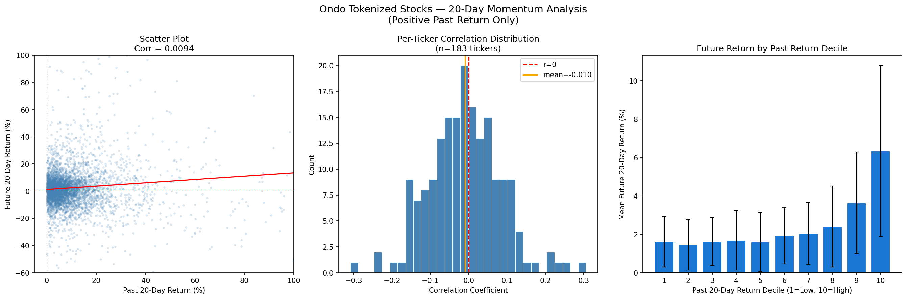

# Ondo 토크나이즈 스톡 모멘텀 분석

**작성일:** 2026-05-27

---

## 1. 배경

바이낸스 알파(Binance Alpha)의 **Tokenized Securities** 탭에 상장된 토크나이즈 스톡은 모두 **Ondo Finance** 발행 제품이다. 바이낸스 중앙화 거래소 API로는 조회 불가(BSC 체인 DEX 토큰)이며, CoinGecko의 `ondo-tokenized-assets` 카테고리 API로 전체 목록을 수집했다.

---

## 2. 데이터 수집

### 2-1. 종목 목록
- **소스:** CoinGecko API (`/coins/markets?category=ondo-tokenized-assets`)
- **총 264개** 종목 수집 (주식 + ETF + 원자재/채권)
- 저장 파일: `ondo_tokenized_stocks.csv`, `ondo_tokenized_stocks.json`

**카테고리 분류**

| 구분 | 수량 (추정) |
|------|------------|
| 개별 주식 | ~180개 |
| ETF (SPY, QQQ, IVV 등) | ~50개 |
| 원자재·채권 (Gold, Silver, 국채 등) | ~30개 |
| **합계** | **264개** |

**주요 종목 (티커·기초자산)**

| Ondo 티커 | 기초자산 |
|-----------|---------|
| AAPLon | Apple |
| TSLAon | Tesla |
| NVDAon | NVIDIA |
| GOOGLon | Alphabet |
| MSFTon | Microsoft |
| METAon | Meta |
| AMZNon | Amazon |
| CRCLon | Circle |
| MUon | Micron |
| SPYon | SPDR S&P 500 ETF |
| QQQon | Invesco QQQ ETF |
| IVVon | iShares Core S&P 500 ETF |
| SLVon | iShares Silver Trust |
| IBITon | iShares Bitcoin Trust |

### 2-2. 가격 데이터
- **소스:** Yahoo Finance (`yfinance`)
- **기간:** 2016-05-31 ~ 2026-05-26 (10년)
- **대상:** 개별 주식 195개 티커 (ETF·펀드 제외)
- **유효 종목:** 183개 (500거래일 이상 데이터 보유)

---

## 3. 모멘텀 분석

### 3-1. 분석 설계

- **과거 수익률:** 20거래일(약 1개월) 수익률
- **미래 수익률:** 이후 20거래일 수익률
- **필터:** 과거 20일 수익률 > 0 인 경우만
- **관측값:** 전체 394,436건 중 양수 구간 **219,687건 (55.7%)**

### 3-2. 결과

| 지표 | 값 |
|------|----|
| 전체 Pearson 상관계수 | −0.0019 |
| **양수 구간 Pearson 상관계수** | **+0.0094** |
| 종목별 평균 상관계수 | −0.010 |
| 양의 상관 종목 비율 | 44.3% |

**종목별 상위 (양의 모멘텀 지속)**

| 티커 | 상관계수 |
|------|---------|
| OPEN | +0.306 |
| MP | +0.258 |
| CMG | +0.240 |
| NIO | +0.223 |
| INTC | +0.208 |

**종목별 하위 (단기 반등 후 되돌림)**

| 티커 | 상관계수 |
|------|---------|
| GRAB | −0.309 |
| VFS | −0.246 |
| RIVN | −0.236 |
| DASH | −0.203 |
| LUNR | −0.173 |

### 3-3. 차트

- **왼쪽 (산점도):** 과거 vs 미래 20일 수익률. 상관관계 거의 없음.
- **가운데 (히스토그램):** 종목별 상관계수 분포 (-0.3 ~ +0.3). 평균 ≈ 0.
- **오른쪽 (분위 분석):** 상위 분위에서 미래 수익률이 소폭 높아지나 통계적으로 유의미하지 않음.

---

## 4. 결론

**20일 단순 모멘텀은 미래 20일 수익률을 예측하지 못한다.**

- 상관계수 ≈ 0 → 예측력 없음
- 종목 평균 상관계수 음수 → 오히려 단기 **평균회귀** 경향이 우세
- 고전 모멘텀 연구(Jegadeesh & Titman, 1993)와 일치하는 패턴:

| 기간 | 패턴 |
|------|------|
| 1개월 이하 단기 | 평균회귀 (역모멘텀) |
| 3~12개월 중기 | **모멘텀 지속** ← 유효 구간 |
| 3년 이상 장기 | 다시 평균회귀 |

---

## 5. 다음 연구 방향 (미정)

- [ ] 60일 / 120일 / 252일 수익률 → 20일 미래 수익률 상관관계
- [ ] 크로스섹셔널 모멘텀 (매월 상위 N종목 vs 하위 N종목 롱숏 백테스트)
- [ ] 모멘텀 + 변동성 조합 팩터

---

## 6. 코드

| 파일 | 설명 |
|------|------|
| `ondo_tokenized_stocks.csv` | Ondo 전체 264개 종목 목록 |
| `ondo_tokenized_stocks.json` | 동일, JSON 형식 |
| `momentum_ondo.py` | 데이터 수집 및 모멘텀 분석 스크립트 |
| `research/momentum_ondo.png` | 분석 결과 차트 |
